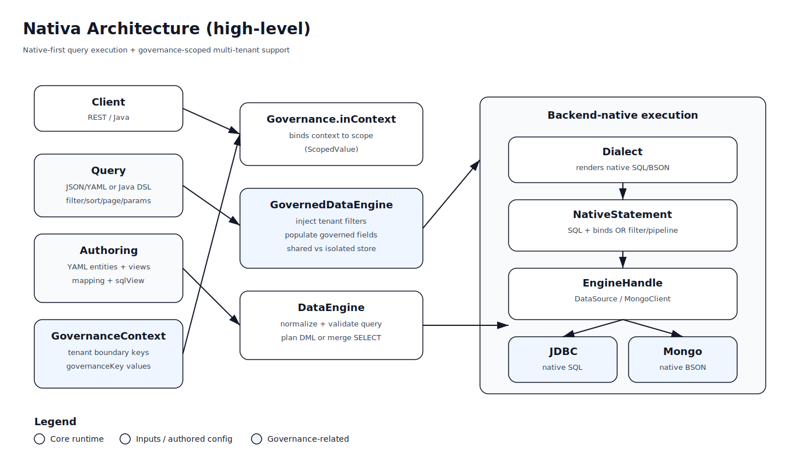

# Nativa Docs (Home)

This is the **documentation hub** for Nativa.

## 1. Purpose of Nativa

Nativa is a **persistence framework** that provides a **general-purpose query language** across multiple backends, while keeping execution **native** to each backend for performance and flexibility.

### 1.1 General-purpose query language

Nativa exposes a single query model (`Query`) that works consistently across backends:
- filter (AND/OR/NOT + conditions)
- sort
- paging (offset + seek)
- projection
- groupBy
- params

### 1.2 Native-first (not ORM)

Nativa is not an ORM abstraction layer.

- **JDBC**: you author native SQL (`sqlView.sql`) and Nativa merges filters/sort/paging into native SQL with binds.
- **Mongo**: you author a base filter object or aggregation pipeline, and Nativa appends/merges query conditions.

This keeps you able to write **complex queries** (joins, projections, window functions, custom pipelines, etc.) that are often painful or impossible through ORM query builders.

### 1.3 Avoids N+1 and big entity graph problems

Instead of navigating object graphs and relying on lazy-loading, Nativa encourages:
- **data-oriented views** (authoring defines what the view returns)
- explicit joins/projections/pipelines in native query definitions

This avoids common ORM scaling issues like **N+1** queries and **huge entity graphs**.

### 1.4 Data-oriented

Nativa is centered around:
- authored **views** (what data is returned and how it maps)
- a stable **query surface** exposed via REST and/or Java

### 1.5 Governance-oriented (multi-tenant)

Nativa supports governance and multi-tenant patterns via:
- `GovernanceContext` (per request scope)
- `GovernedDataEngine` wrapper (filter injection + governed field population)
- tenant-boundary rules (including dynamic tenant keys via `tenantKeys()`)

### 1.6 Hooks / SPI extensibility

Nativa is designed to be extended via hooks/SPI:
- **Dialects**: add/override a dialect to support new SQL backends or behaviors.
- **Governance behavior**: customize tenant boundary rules or governance enforcement patterns.
- **Query validation**: enforce strictness via `QueryValidationStrategy`.
- **Binders / UserTypes / row readers**: customize encoding/decoding and result mapping.

## 2. Architecture diagram

## 3. Navigation

The best way to learn Nativa is in this order:
- **Authoring**: define *what data exists* and *how it maps* to backend-native columns/paths and views.
- **Query**: define *how to ask for data* (filter/sort/page/groupBy/params) in a backend-agnostic way.
- **DataEngine**: execute Query and DML (insert/update/upsert/delete) through native backends, with transactions and governance.

### Authoring
Authoring is the **single source of truth** for entities, fields, views, mappings, and native view definitions (`sqlView`). It connects logical property paths (like `customer.firstName`) to backend-native expressions/paths, and it powers Query rendering, DML planning, and row mapping.

- **Reference**: [`docs/authoring/README.md`](authoring/README.md)
- **Examples**:
  - JDBC: [`docs/authoring/Jdbc.md`](authoring/Jdbc.md)
  - Mongo: [`docs/authoring/Mongo.md`](authoring/Mongo.md)

### Query
Query is the portable **query model** used by REST/Java callers. It provides a stable, backend-agnostic shape for filters (AND/OR/NOT), sorting, paging (offset/seek), grouping, projection, and params—then renderers turn it into native SQL/BSON.

- **Reference**: [`docs/query/README.md`](query/README.md)
- **Examples**:
  - JDBC: [`docs/query/Jdbc.md`](query/Jdbc.md)
  - Mongo: [`docs/query/Mongo.md`](query/Mongo.md)

### DataEngine
DataEngine is the runtime API that executes **reads and writes**: it resolves authoring, normalizes and validates queries, renders native statements via a dialect, executes them using the backend handle, and maps results back to POJOs. It also provides `inTx(...)` for transactions and is commonly wrapped by governance.

- **Reference**: [`docs/dataengine/README.md`](dataengine/README.md)
- **Examples**:
  - JDBC: [`docs/dataengine/Jdbc.md`](dataengine/Jdbc.md)
  - Mongo: [`docs/dataengine/Mongo.md`](dataengine/Mongo.md)

